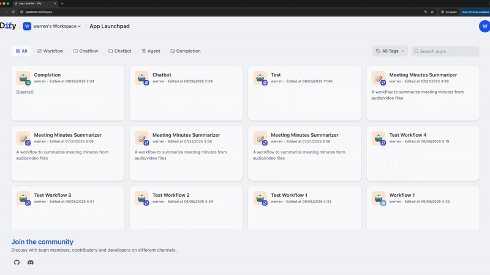

# Dify Launchpad

A streamlined studio interface for launching Dify applications directly to their published URLs.




## Prerequisites

**⚠️ Important: You must have a running Dify instance before setting up the launchpad.**

The Dify Launchpad is a frontend interface that connects to your existing Dify backend to display and launch your published apps. It requires:

1. **Running Dify Backend**: A fully operational Dify instance (self-hosted or cloud)
2. **Published Apps**: At least one app published in your Dify instance with `enable_site: true`

### Dify Setup

If you don't have Dify running yet:

- **Self-hosted**: Follow the [Dify Quickstart](https://github.com/langgenius/dify?tab=readme-ov-file#quick-start)

Make sure you can access your Dify console (usually at `http://your-domain/console`) before proceeding.

## Quick Start

### 🐳 Docker Compose (Recommended)

1. **Clone and Configure**
   ```bash
   git clone <repository-url>
   cd dify-launchpad
   cp .env.example .env
   ```

2. **Edit Configuration**
   ```bash
   # Edit .env file with your EXISTING Dify instance settings
   DIFY_BACKEND_URL=http://your-existing-dify-backend
   DIFY_APP_BASE_URL=http://your-existing-dify-domain
   LAUNCHPAD_PORT=3000
   ```
   
   **Examples:**
   - Local Dify: `DIFY_BACKEND_URL=http://localhost`
   - Docker Dify: `DIFY_BACKEND_URL=http://dify-api`
   - Remote Dify: `DIFY_BACKEND_URL=https://api.yourdify.com`

3. **Launch**
   ```bash
   docker-compose up -d
   ```

4. **Access Launchpad**
   Visit `http://localhost:3000`

### 💻 Development Setup

1. **Install Dependencies**
   ```bash
   cd web
   pnpm install
   ```

2. **Configure Environment**
   ```bash
   cp web/.env.example web/.env.local
   # Edit .env.local with your EXISTING Dify backend URLs and app base URL
   ```
   
   Key settings in `.env.local`:
   ```bash
   # Backend API (point to your existing Dify instance)
   NEXT_PUBLIC_API_PREFIX=http://localhost/console/api
   
   # App base URL (where your published Dify apps are accessed)
   NEXT_PUBLIC_APP_BASE_URL=http://localhost
   ```

3. **Start Development**
   ```bash
   cd web
   pnpm dev
   ```

4. **Open Launchpad**
   Visit `http://localhost:3000`

## Requirements

### Docker Setup
- Docker and Docker Compose
- Running Dify backend API

### Development Setup
- Node.js 22.11.0+
- pnpm package manager
- Running Dify backend API (default: `http://localhost`)

## App Launch URLs

The launchpad launches apps using these URL patterns:

- **Chat Apps** (chat, chatbot, agent): `http://<domain>/chat/<token>`
- **Workflow Apps**: `http://<domain>/workflow/<token>`  
- **Completion Apps**: `http://<domain>/completion/<token>`

Examples:
- `http://localhost/chat/GBv6Bj20TpfYaYz3` (chat/chatbot/agent)
- `http://localhost/workflow/OJdhdgidf4ubtyZ1` (workflow)
- `http://localhost/completion/SCWBm3K2a92yzU3T` (completion)

## Documentation

- [Setup Guide](web/SETUP.md) - Detailed installation and configuration
- [Changes Made](web/LAUNCHPAD_CHANGES.md) - Technical modifications summary

## Docker Configuration

### Environment Variables

The Docker setup uses these key environment variables (configure in `.env`):

| Variable | Description | Default |
|----------|-------------|---------|
| `DIFY_BACKEND_URL` | Your Dify backend API URL | `http://127.0.0.1` |
| `DIFY_APP_BASE_URL` | Domain where published apps are accessed | `http://127.0.0.1` |
| `LAUNCHPAD_PORT` | Port to run the launchpad on | `3000` |
| `MARKETPLACE_API_URL` | Marketplace API URL (optional) | `https://marketplace.dify.ai` |
| `MARKETPLACE_URL` | Marketplace URL (optional) | `https://marketplace.dify.ai` |

### Docker Commands

```bash
# Build and start
docker-compose up -d

# View logs
docker-compose logs -f dify-launchpad

# Stop
docker-compose down

# Rebuild after changes
docker-compose up -d --build

# Check status
docker-compose ps
```

### Production Deployment

For production, consider:

1. **Use a reverse proxy** (nginx, Traefik, etc.)
2. **Enable HTTPS**
3. **Configure proper domains** in your `.env`
4. **Set up monitoring** using the health check endpoint

## Troubleshooting

**"Failed to fetch" errors?**  
→ Ensure your Dify backend is running and accessible  
→ Check CORS settings if running on different domains

**No apps showing?**  
→ Check that apps have `enable_site: true` and valid access tokens  
→ Verify `DIFY_BACKEND_URL` is correctly configured

**Build issues?**  
→ Clear cache with `rm -rf web/.next` and rebuild  
→ For Docker: `docker-compose down && docker-compose up -d --build`

**Docker container won't start?**  
→ Check logs: `docker-compose logs dify-launchpad`  
→ Verify `.env` file configuration  
→ Ensure ports aren't already in use

## License

This project follows the same license as the original Dify project.